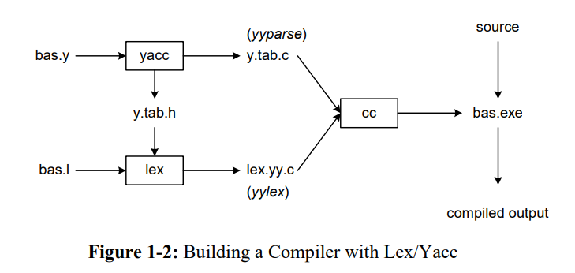

# Example

Como deve ser feito o exemplo

## Lex
Encontra identificadores na input e os adiciona na tabela de símbolos. A tabela deve conter outras informações como DataType e localização da variável na memória.


## Yacc
Gera o código C para o analisador sintático. Usa regras da gramática para analisar os tokens encontrados pelo lex e cria a árvore sintática. A gração de código é feita através de uma DFS na árvore sintática.

## Uso do Yacc e Lex


## Comandos para criar o compilador
```
yacc -d example.y               # cria y.tab.h y.tab.c
lex example.l                   # cria lex.yy.c
gcc lex.yy.c y.tab.c -o main    # compile
```

Claro que teria um script pra compilar né!

```
./compile.sh
```

## Executando
```
./main < input
```